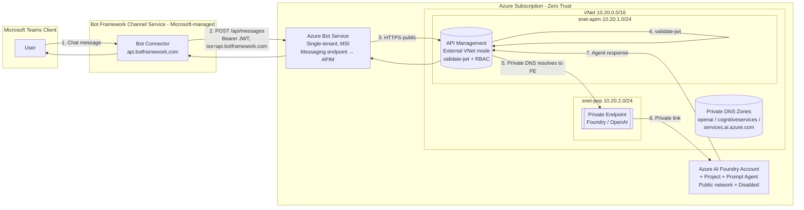

# Secure Teams → Bot → APIM → Private Azure AI Foundry Agent

End-to-end reference implementation for exposing an **Azure AI Foundry prompt agent**
(e.g. a "Travel Agent" hosted under
`https://sbodhankar-aveva-demo-resource.services.ai.azure.com/api/projects/sbodhankar-aveva-demo`)
to **Microsoft Teams** through an **Azure Bot Service** and **API Management (APIM)**,
following **Zero Trust** networking and identity principles.

> The Foundry agent itself is a *prompt agent* (no custom backend code). All routing,
> authentication, throttling and policy enforcement happen in APIM — the only public
> surface — and the Foundry endpoint is reached over a Private Endpoint inside a VNet.

---

## 1. Repository layout

```
Teams-Secure-Endpoint/
├── README.md                         # Architecture diagram + explanation (this file)
├── infra/
│   ├── main.bicep                    # Top-level deployment (subscription/RG scope)
│   ├── main.parameters.json          # Example parameters
│   └── modules/
│       ├── network.bicep             # VNet, subnets, NSGs, Private DNS zones
│       ├── foundry.bicep             # Azure AI Foundry (AI Services) account + project + prompt agent
│       ├── privateEndpoint.bicep     # Private Endpoint for Foundry/OpenAI
│       ├── apim.bicep                # APIM (External VNet mode) + API + product + policy
│       ├── bot.bicep                 # Azure Bot Service (single-tenant) + MSI
│       └── rbac.bicep                # Role assignments (Azure AI User, etc.)
└── policies/
    ├── apim-global-policy.xml        # Global JWT validate-jwt for Bot Framework
    └── apim-agent-api-policy.xml     # Per-API policy: rewrite + forward to private Foundry
```

---

## 2. Architecture diagram



**Request path**

1. User sends a message in Teams.
2. Teams → Bot Framework Channel Service → POSTs an Activity to the Bot's
   `messagingEndpoint`, signed as a JWT issued by `https://api.botframework.com`.
3. The Bot Service relays the activity (or, in this design, the Bot's messaging
   endpoint is fronted by APIM directly — see "Variants" below).
4. APIM enforces `validate-jwt` against the Bot Framework OpenID configuration.
5. APIM resolves the Foundry hostname via **Azure Private DNS** to the **Private
   Endpoint IP** inside the VNet.
6. Traffic to Azure AI Foundry never traverses the public internet.
7. Response flows back the same path.

---

## 3. Why this shape

| Concern | Decision | Rationale |
|---|---|---|
| Public surface | **Only APIM** is public | Bot Framework Connector is a SaaS service and must reach the messaging endpoint over the internet. APIM is the single, hardened ingress. |
| AuthN at the edge | `validate-jwt` against `https://login.botframework.com/v1/.well-known/openidconfiguration` | Guarantees the caller is the Bot Framework service, not an attacker spoofing the URL. |
| AuthZ to Foundry | Managed Identity on APIM + **Azure AI User** RBAC | No keys in policy, rotation handled by Entra ID. |
| Backend exposure | **Private Endpoint** + `publicNetworkAccess: Disabled` on the Foundry account | Even with a leaked key, the endpoint is unreachable from the internet. |
| Tenancy | Bot configured as **single tenant** (`msaAppType: SingleTenant`) | Reduces blast radius; only your tenant's identities can authenticate against the app registration. |
| DNS | Azure Private DNS zones linked to VNet | APIM resolves `*.openai.azure.com` / `*.services.ai.azure.com` / `*.cognitiveservices.azure.com` to the private IP. |
| Defense in depth | NSGs on every subnet, APIM in **External** VNet mode | Subnets are segmented; APIM can still receive public ingress while egress is VNet-routed. |
| Optional WAF | Internal-mode APIM + App Gateway + WAF v2 | Adds OWASP rule set in front of APIM (see Variants). |

### Zero Trust mapping

- **Verify explicitly** — APIM verifies every request's JWT signature, issuer
  (`https://api.botframework.com`), audience (your bot's `MicrosoftAppId`), and
  expiry on every call.
- **Use least-privilege access** — APIM's system-assigned MSI is granted only
  the `Azure AI User` role on the specific Foundry account. No keys exist in
  the policy or app settings.
- **Assume breach** — The Foundry account has `publicNetworkAccess: Disabled`;
  even if the APIM gateway key or a backend URL leaks, the AI service cannot
  be reached from the internet. NSGs and private DNS constrain lateral movement.

---

## 4. Deploy

```powershell
# Login + select subscription
az login
az account set --subscription "<your-sub-id>"

# Create the resource group
az group create -n rg-teams-ai-secure -l eastus2

# Deploy
az deployment group create `
  --resource-group rg-teams-ai-secure `
  --template-file infra/main.bicep `
  --parameters @infra/main.parameters.json
```

After deployment:

1. In the Azure portal, open the **Bot Service** → *Configuration* and set the
   **Messaging endpoint** to your APIM URL, e.g.
   `https://apim-teams-ai-<suffix>.azure-api.net/bot/api/messages`.
2. Add the **Microsoft Teams** channel on the Bot Service.
3. In **Microsoft Foundry**, create the *Travel Agent* prompt agent inside the
   project (`sbodhankar-aveva-demo`) — the Bicep provisions the account/project
   placeholders; the agent itself is created in the Foundry portal because it
   is a prompt agent with no code.
4. Sideload the Teams app manifest (or publish via Teams Admin Center).

---

## 5. Variants / enhancements

- **Internal APIM + App Gateway + WAF v2** — move APIM to `virtualNetworkType: Internal`
  and place an Application Gateway with the OWASP 3.2 rule set in front. The Bot
  Service's messaging endpoint then targets the App Gateway public IP / FQDN.
- **Azure Front Door Premium** with Private Link to APIM — global anycast +
  managed WAF, useful for multi-region.
- **Defender for APIs** on APIM for runtime anomaly detection.
- **Key Vault references** for any remaining secrets (Bot password if not using
  MSI-based federated identity).
- **Diagnostic settings** to Log Analytics + Sentinel for all three: APIM,
  Bot, Foundry.
- **Private DNS resolver** if you need on-prem resolution of the private FQDNs.
- **CMK (customer-managed keys)** on the Foundry account.
- **Conditional Access** policies targeting the Bot's app registration.
