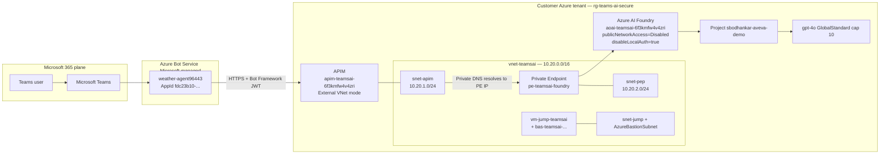

# Customer Walkthrough — Teams → Azure AI Foundry Agent via Private Endpoint

> A guided script for explaining the deployed reference architecture end-to-end.
> Subscription: `ME-MngEnvMCAP628198-sbodhankar-1` (`852f8491-61e9-4d75-b79a-9744a28c42a5`)
> Tenant: `c508696d-bdfc-487a-b57b-138782c41da2`
> Region: `eastus2`
> Resource group: `rg-teams-ai-secure`

---

## TL;DR — what we built

A **Microsoft Teams user** sends a message to the **Weather Agent**. The message is brokered by **Azure Bot Service**, validated and routed by **Azure API Management (APIM)**, and reaches **Azure AI Foundry** through a **Private Endpoint** — without the Foundry data plane ever being exposed to the public internet. The agent (`weather-agent`) runs on **gpt-4o** inside the Foundry project `sbodhankar-aveva-demo` and replies along the same private path.



---

## Section 1 — Foundation: Foundry account, project, model

We start with the AI service itself, then progressively wrap network controls around it.

### 1.1 Azure AI Foundry account
- **Resource type:** `Microsoft.CognitiveServices/accounts`
- **Name:** `aoai-teamsai-6f3kmfw4v4zri`
- **Kind:** `AIServices` (the umbrella SKU that hosts OpenAI + Foundry projects)
- **API version used:** `2025-04-01-preview`
- **Key settings:**
  - `allowProjectManagement: true` — required to create child projects under an `AIServices` kind account
  - `publicNetworkAccess: 'Disabled'` — data plane is only reachable via the Private Endpoint
  - `disableLocalAuth: true` — **no API keys**; all auth is Entra ID (RBAC + tokens)
  - `networkAcls.defaultAction: 'Deny'`
  - `customSubDomainName: aoai-teamsai-6f3kmfw4v4zri` — required for private DNS to work
- **Defined in:** [infra/modules/foundry.bicep](infra/modules/foundry.bicep)

### 1.2 Foundry project
- **Resource type:** `Microsoft.CognitiveServices/accounts/projects`
- **Name:** `sbodhankar-aveva-demo` (child of the account above)
- **Identity:** system-assigned managed identity (the project itself can call Azure resources without secrets)

### 1.3 Model deployment
- **Resource type:** `Microsoft.CognitiveServices/accounts/deployments`
- **Name:** `gpt-4o`
- **Model:** `OpenAI / gpt-4o / 2024-11-20`
- **SKU:** `GlobalStandard`, capacity `10` (10K TPM)
- **Content safety policy:** `Microsoft.DefaultV2`

### 1.4 The agent
- **Name:** `weather-agent`
- **Created via:** Foundry portal (or programmatically via [scripts/create-weather-agent.ps1](scripts/create-weather-agent.ps1))
- **Backed by:** the `gpt-4o` deployment above
- **Instructions:** focused on weather forecasts and current conditions

---

## Section 2 — Network: private-by-default

### 2.1 Virtual network
- **Resource:** `vnet-teamsai`
- **Address space:** `10.20.0.0/16`
- **Defined in:** [infra/modules/network.bicep](infra/modules/network.bicep)

| Subnet | CIDR | Purpose | NSG |
|---|---|---|---|
| `snet-apim` | `10.20.1.0/24` | APIM injection (External VNet mode) | `nsg-teamsai-apim` — allows ApiManagement service tag :3443 mgmt, Internet :443 in |
| `snet-pep` | `10.20.2.0/24` | Hosts Private Endpoint NICs; `privateEndpointNetworkPolicies: Disabled` | `nsg-teamsai-pe` — VNet :443 only; Internet denied |
| `AzureBastionSubnet` | `10.20.3.0/26` | Required exact name for Bastion | (Bastion-managed) |
| `snet-jump` | `10.20.4.0/24` | Jumpbox VM | `nsg-teamsai-jump` — only Bastion may RDP/SSH; Internet denied |

### 2.2 Private Endpoint
- **Resource:** `pe-teamsai-foundry` (`Microsoft.Network/privateEndpoints`)
- **Group ID:** `account` (the Foundry / Cognitive Services data plane group)
- **Bound to:** Foundry account `aoai-teamsai-6f3kmfw4v4zri`
- **Subnet:** `snet-pep`
- **Defined in:** [infra/modules/privateEndpoint.bicep](infra/modules/privateEndpoint.bicep)

### 2.3 Private DNS zones (all linked to the VNet)
| Zone | Purpose |
|---|---|
| `privatelink.openai.azure.com` | Legacy OpenAI hostname |
| `privatelink.cognitiveservices.azure.com` | Generic Cognitive Services hostname |
| `privatelink.services.ai.azure.com` | Modern AI Services / Foundry hostname (this is the one APIM resolves at runtime) |

The Private Endpoint's **DNS zone group** auto-creates A records in all three zones, so any client inside the VNet resolves Foundry's FQDNs to the PE's private IP (an address from `10.20.2.0/24`) instead of the public anycast IP.

### 2.4 Jumpbox + Bastion (admin path)
- **VM:** `vm-jump-teamsai`, Windows Server 2022 Azure Edition, `Standard_DC2s_v3` (Trusted Launch, secure boot, vTPM), **no public IP**, system MSI
- **Bastion:** `bas-teamsai-6f3kmfw4v4zri`, Standard SKU with `enableTunneling: true`
- **Credential:** local admin `azureadmin` / password set during deploy
- **Defined in:** [infra/modules/jumpbox.bicep](infra/modules/jumpbox.bicep)
- **Why:** when `publicNetworkAccess` is Disabled, the Foundry portal can't manage the account from a browser on the open internet. Admins RDP via Bastion into this VM, which is inside the VNet and resolves Foundry via the private endpoint.

---

## Section 3 — Single ingress: API Management

### 3.1 APIM service
- **Name:** `apim-teamsai-6f3kmfw4v4zri`
- **SKU:** `Developer` (1 unit) — for production swap to **Premium** which is the only SKU that supports VNet *injection* in HA
- **VNet mode:** **External**
  - APIM keeps a **public IP** (Bot Service must reach it from Microsoft's network)
  - Egress is **routed through the VNet** via `snet-apim` — so calls to Foundry exit privately through the PE
- **Identity:** system-assigned managed identity (used for RBAC, App Insights, KeyVault if needed)
- **Defined in:** [infra/modules/apim.bicep](infra/modules/apim.bicep)

### 3.2 Named values (config not in code)
| Name | Value | Used by |
|---|---|---|
| `bot-app-id` | `37fadbac-08c5-4cd4-9e9c-df61c9244c4a` (your pre-provisioned bot) | `validate-jwt` audience |
| `foundry-bot-app-id` | `fdc23b10-9517-438b-8752-d104fd5b833a` (auto-created by Foundry's "Publish to Teams") | `validate-jwt` audience |
| `tenant-id` | `c508696d-bdfc-487a-b57b-138782c41da2` | Available for issuer pinning |

### 3.3 Global policy ([policies/apim-global-policy.xml](policies/apim-global-policy.xml))
Runs on **every** request hitting APIM:
1. **HTTPS-only enforcement** — non-HTTPS returns 403 immediately.
2. **`validate-jwt`** against Bot Framework's well-known OIDC config:
   - `openid-config: https://login.botframework.com/v1/.well-known/openidconfiguration`
   - `issuer: https://api.botframework.com`
   - `audiences: { bot-app-id, foundry-bot-app-id }`
   - Failure returns **401**.
3. **Authorization header is preserved** (we deliberately do *not* strip it, because the upstream Foundry agent endpoint validates the same Bot Framework JWT itself).
4. Strip Server / X-Powered-By / X-AspNet-Version on the way out.

### 3.4 API surface: `bot-agent`
- **API path:** `/bot`
- **Operation:** `POST /api/messages`
- **Full public URL:** `https://apim-teamsai-6f3kmfw4v4zri.azure-api.net/bot/api/messages`
- **subscriptionRequired:** `false` (auth is the JWT, not an APIM subscription key)

### 3.5 API policy ([policies/apim-agent-api-policy.xml](policies/apim-agent-api-policy.xml))
Runs after the global policy succeeds:
1. **Correlation ID** injected as `x-correlation-id` for end-to-end traceability.
2. **`set-backend-service`** to `https://aoai-teamsai-6f3kmfw4v4zri.services.ai.azure.com` — this FQDN is in `privatelink.services.ai.azure.com`, so APIM's resolver returns the **PE private IP**.
3. **`rewrite-uri`** transforms `/bot/api/messages` → `/api/projects/sbodhankar-aveva-demo/agents/weather-agent/endpoint/protocols/activityprotocol?api-version=2025-11-15-preview` — the exact Foundry agent activity-protocol endpoint.
4. **`forward-request timeout="60"`** — fail fast.

---

## Section 4 — Identity: Bot Service + RBAC

### 4.1 Bot Service resources
| Bot | Microsoft App ID | Messaging endpoint | Notes |
|---|---|---|---|
| `bot-teamsai-6f3kmfw4v4zri` | `37fadbac-08c5-4cd4-9e9c-df61c9244c4a` | `https://apim-teamsai-.../bot/api/messages` | Pre-provisioned by our Bicep; currently idle, kept as a "spare" |
| `weather-agent96443` | `fdc23b10-9517-438b-8752-d104fd5b833a` | `https://apim-teamsai-.../bot/api/messages` (we repointed this from Foundry's default) | **Auto-created** by Foundry's "Publish to Teams" flow; this is the bot Teams actually uses |

- **App registration type:** Single-tenant (`msaAppType: 'SingleTenant'`) — only your tenant can authenticate.
- **Channel:** Microsoft Teams (`Microsoft.BotService/botServices/channels` with `name: MsTeamsChannel`)

### 4.2 RBAC role assignments
On the **Foundry account** scope:

| Principal | Role | Why |
|---|---|---|
| APIM system MSI | **Azure AI User** (`53ca6127-db72-4b80-b1b0-d745d6d5456d`) | Lets APIM (and policies) call the Foundry data plane on behalf of the gateway |
| Jumpbox VM system MSI | **Azure AI User** | Lets admin scripts on the jumpbox use `az` token to call Foundry without keys |

- **Defined in:** [infra/modules/rbac.bicep](infra/modules/rbac.bicep) (module is called twice from `main.bicep`)
- **Idempotency:** role assignment name is `guid(foundry.id, principalId, roleId)` — safe to redeploy.

---

## Section 5 — Request lifecycle (end-to-end)

Walk this through with the customer message-by-message:

1. **User types "What's the weather in Houston tomorrow?"** in the Teams Weather Agent chat.
2. **Teams** routes the message to **Azure Bot Service** for bot `weather-agent96443`.
3. **Bot Service** signs an outbound HTTPS POST with a **Bot Framework JWT**:
   - Issued by `https://api.botframework.com`
   - Audience = `fdc23b10-...` (the bot's App ID)
   - Sent in `Authorization: Bearer <jwt>` to `https://apim-teamsai-6f3kmfw4v4zri.azure-api.net/bot/api/messages`.
4. **APIM ingress** (global policy):
   - Confirms HTTPS.
   - `validate-jwt` succeeds because the JWT's `aud` matches `foundry-bot-app-id`.
   - `Authorization` is preserved.
5. **APIM API policy** (`bot-agent`):
   - Tags request with `x-correlation-id`.
   - Sets backend → `https://aoai-teamsai-6f3kmfw4v4zri.services.ai.azure.com`.
   - Rewrites path → `/api/projects/sbodhankar-aveva-demo/agents/weather-agent/endpoint/protocols/activityprotocol?api-version=2025-11-15-preview`.
6. **APIM egress**: leaves through `snet-apim`. DNS resolves `aoai-teamsai-6f3kmfw4v4zri.services.ai.azure.com` via `privatelink.services.ai.azure.com` → **PE NIC at a 10.20.2.x private IP**. Traffic never traverses the public internet.
7. **Private Endpoint → Foundry data plane**: Foundry validates the Bot Framework JWT (it knows `fdc23b10-...` is registered as a channel bot for `weather-agent`), invokes the agent.
8. **Agent runtime**: `weather-agent` constructs a prompt, calls **gpt-4o** (GlobalStandard, in-region), formats a response.
9. **Response path**: Foundry → PE → APIM (outbound headers cleaned) → Bot Service → Teams → User.

---

## Section 6 — Zero Trust mapping

| Zero Trust principle | How this architecture enforces it |
|---|---|
| **Verify explicitly** | Every request: HTTPS + `validate-jwt` (Bot Framework OIDC, issuer pinned, audience pinned, signature + expiration required) |
| **Use least privilege** | Roles scoped to the Foundry account only (not RG/sub); single role = "Azure AI User"; no Contributor/Owner anywhere in the runtime path |
| **Assume breach — network** | `publicNetworkAccess: Disabled` on Foundry; PE is the only data path; NSG denies Internet on `snet-pep` and `snet-jump`; jumpbox has no public IP |
| **Assume breach — identity** | `disableLocalAuth: true` (no API keys); all auth is Entra ID tokens; Bot is **single-tenant** |
| **Inspect & log** | `x-correlation-id` injected per request; APIM diagnostic logs + Bot Service activity logs + Foundry telemetry can be wired to Log Analytics |
| **One ingress** | APIM is the only public surface; everything else (Foundry, jumpbox, PE) is private |

---

## Section 7 — Operational notes

- **Toggling Foundry public access**: Foundry portal management requires public access. Enable temporarily for portal work, disable for steady state:
  ```powershell
  $id = az cognitiveservices account show -g rg-teams-ai-secure -n aoai-teamsai-6f3kmfw4v4zri --query id -o tsv
  az resource update --ids $id --set properties.publicNetworkAccess=Enabled  properties.networkAcls.defaultAction=Allow
  # ... do portal work ...
  az resource update --ids $id --set properties.publicNetworkAccess=Disabled
  ```
- **Admin access to the VM**: `az network bastion rdp --name bas-teamsai-6f3kmfw4v4zri -g rg-teams-ai-secure --target-resource-id <vm id>` (or use the Bastion blade in the portal).
- **Updating policies without a full redeploy**: edit the XML under `policies/`, then PUT them onto APIM directly via `az rest` (we did this for the live fix).
- **Adding a new agent**: create the agent in the Foundry project (portal or script), update `apim-agent-api-policy.xml` `rewrite-uri` path with the new agent name, re-publish to Teams from Foundry, and repoint the auto-created bot's endpoint at APIM.

---

## Section 8 — Resource inventory (everything in `rg-teams-ai-secure`)

| Type | Name | Purpose |
|---|---|---|
| `Microsoft.Network/virtualNetworks` | `vnet-teamsai` | VNet |
| `Microsoft.Network/networkSecurityGroups` | `nsg-teamsai-apim`, `nsg-teamsai-pe`, `nsg-teamsai-jump` | Subnet NSGs |
| `Microsoft.Network/privateDnsZones` (x3) | `privatelink.openai.azure.com` etc. | Private DNS resolution |
| `Microsoft.CognitiveServices/accounts` | `aoai-teamsai-6f3kmfw4v4zri` | Foundry account |
| `Microsoft.CognitiveServices/accounts/projects` | `sbodhankar-aveva-demo` | Project |
| `Microsoft.CognitiveServices/accounts/deployments` | `gpt-4o` | Model |
| `Microsoft.Network/privateEndpoints` | `pe-teamsai-foundry` | Foundry PE |
| `Microsoft.ApiManagement/service` | `apim-teamsai-6f3kmfw4v4zri` | APIM gateway |
| `Microsoft.BotService/botServices` | `bot-teamsai-6f3kmfw4v4zri`, `weather-agent96443` | Bot registrations |
| `Microsoft.Network/bastionHosts` | `bas-teamsai-6f3kmfw4v4zri` | Bastion |
| `Microsoft.Compute/virtualMachines` | `vm-jump-teamsai` | Jumpbox |
| `Microsoft.Authorization/roleAssignments` | (per MSI) | APIM + VM MSI → Azure AI User on Foundry |

---

## Section 9 — What's *not* here (and easy next steps)

- **Lock APIM ingress to Bot Service IPs only** — restrict `snet-apim` NSG inbound to service tag `AzureBotService` instead of `Internet`.
- **Premium APIM** for production HA + zone redundancy.
- **Customer-managed keys (CMK)** on Foundry — point at a Key Vault behind its own PE.
- **Defender for Cloud + Microsoft Sentinel** wiring — APIM, Bot Service, and Foundry all emit to Log Analytics.
- **PIM-only privileged role activation** for any Owner/Teams Admin work, instead of standing assignments.
- **CI/CD** for the Bicep + policy XML (currently deployed via `az deployment group create` from a developer workstation).

---

## Section 10 — Anticipated questions (with answers you can read aloud)

### Q1. Can APIM be both public and private at the same time?
**Yes — that's what the "External VNet" mode does.** APIM has two faces:

```
  Internet ─▶ [ Public IP door ]
                                  ┌─────────┐
                                  │  APIM   │
                                  └─────────┘
                                       │
                            [ VNet door / NIC in snet-apim ]
                                       │
                                       ▼
                                Your VNet (private endpoint, Foundry)
```

- **Inbound (front door):** keeps a public IP so Microsoft-managed Bot Service can reach it.
- **Outbound (back door):** injected into `snet-apim`, so calls to backends leave through the VNet — DNS resolves Foundry's FQDN to the private endpoint IP.

The three modes are: **None** (pure SaaS), **External** (our choice), **Internal** (no public IP — would need Front Door / App Gateway in front for Bot Service). Configured in [infra/modules/apim.bicep](infra/modules/apim.bicep) as `virtualNetworkType: 'External'`.

### Q2. What is `https://aoai-teamsai-6f3kmfw4v4zri.services.ai.azure.com`?
That's the **data-plane URL of our Foundry / AI Services account** — Microsoft assigns one to every account based on the `customSubDomainName`.

- `aoai-teamsai-6f3kmfw4v4zri` = our account's unique custom subdomain
- `services.ai.azure.com` = Microsoft's shared parent zone for AI Services

The same account is reachable on three equivalent hostnames (`.openai.azure.com`, `.cognitiveservices.azure.com`, `.services.ai.azure.com`) — different APIs live under each. We use the `.services.ai.azure.com` one because that's where the agent **activityprotocol** endpoint lives.

Inside the VNet, the linked private DNS zone `privatelink.services.ai.azure.com` rewrites this hostname to the private endpoint's IP (`10.20.2.x`), so APIM's outbound call never leaves the VNet.

### Q3. What does `<set-backend-service base-url="...">` do?
Replaces the **host** of the outbound request (everything before the path). After this line, APIM forwards to the Foundry account FQDN. The path/query come from `rewrite-uri` (next).

### Q4. What does `<rewrite-uri template="...">` do?
Replaces the **path + query string**. The Bot Service POSTs `/bot/api/messages`; this line rewrites it to the actual Foundry agent endpoint:
```
/api/projects/sbodhankar-aveva-demo/agents/weather-agent/endpoint/protocols/activityprotocol?api-version=2025-11-15-preview
```

| Segment | Meaning |
|---|---|
| `/api/projects/sbodhankar-aveva-demo` | Foundry project |
| `/agents/weather-agent` | The agent |
| `/endpoint/protocols/activityprotocol` | Foundry's Bot Framework Activity listener |
| `?api-version=2025-11-15-preview` | Required version pin |

To swap in another agent, change just the `/agents/<name>/` segment.

### Q5. How do the two bot App IDs get into APIM's `validate-jwt`?
APIM uses **named values** — a service-scoped key/value store. The policy references `{{bot-app-id}}` and `{{foundry-bot-app-id}}` and APIM substitutes them at request time.

| App ID | Source | Lifecycle |
|---|---|---|
| `37fadbac-...` | Entra app registration created **before** deploy; passed in as `botAppId` parameter | Set by IaC at deploy time |
| `fdc23b10-...` | Created by Foundry portal when you clicked **"Publish to Teams"** on the agent | Filled into APIM **after** Foundry created it, via `az rest` PUT on the named value |

Both are referenced as **audiences** in the global `validate-jwt`, so either bot's token is accepted.

### Q6. Where are APIM named values stored?
**Inside the APIM service itself** as a child resource (`Microsoft.ApiManagement/service/namedValues`). Encrypted at rest with Microsoft-managed keys. Three modes:
1. **Plain** (our case for App IDs — non-secret GUIDs)
2. **Secret** (masked in portal/trace, still stored in APIM)
3. **Key Vault-backed** (only a reference is stored in APIM; the real secret lives in Key Vault and APIM fetches it with its MSI)

View: Portal → APIM → **APIs section → Named values**. CLI:
```powershell
az rest --method get `
  --url ".../Microsoft.ApiManagement/service/apim-teamsai-6f3kmfw4v4zri/namedValues?api-version=2024-05-01" `
  --query "value[].{name:name, value:properties.value}" -o table
```

### Q7. Where do I see the bot's App ID as a GUID?
Four equivalent places — they should all match:
1. **APIM named value** `bot-app-id` (Portal → APIM → Named values)
2. **Bot Service `msaAppId` property** (Portal → bot resource → Configuration)
3. **Entra ID app registration** (Portal → Entra → App registrations → Application (client) ID)
4. **`infra/main.parameters.json`** → `botAppId.value`

### Q8. Where do I see `customSubDomainName` and `networkAcls.defaultAction` in the portal?
On the **Foundry / AI Services account** resource (`aoai-teamsai-6f3kmfw4v4zri`):
- `networkAcls.defaultAction` → **Networking** blade → **Firewalls and virtual networks** tab → "Allowed access from" radio (`All networks` = Allow, `Selected networks / Disabled` = Deny).
- `customSubDomainName` → **Overview blade → JSON View** (top-right) → search `customSubDomainName`. Also visible implicitly as the hostname in any **Endpoint** URL.
- CLI one-liner:
  ```powershell
  az cognitiveservices account show -g rg-teams-ai-secure -n aoai-teamsai-6f3kmfw4v4zri `
    --query "properties.{cs:customSubDomainName, pna:publicNetworkAccess, action:networkAcls.defaultAction}" -o json
  ```

### Q9. Why two bots in the resource group?
- `bot-teamsai-6f3kmfw4v4zri` → pre-provisioned by our Bicep; left in place as a spare and to validate the IaC path.
- `weather-agent96443` → created by Foundry when we clicked **"Publish to Teams"**. This is the one Teams actually talks to.

Both have their messaging endpoint pointing at the **same APIM URL**, so APIM is the single gateway for both.

### Q10. Why did "You cannot send messages to this bot" appear earlier when Foundry public access was disabled?
Foundry's "Publish to Teams" defaulted the new bot's endpoint to Foundry's **public** `services.ai.azure.com` URL. With `publicNetworkAccess: Disabled`, that URL returned 403 from Microsoft-managed Bot Service. **Fix:** repoint the new bot's messaging endpoint at our APIM URL — APIM lives in the VNet and reaches Foundry over the private endpoint, regardless of public access state.
